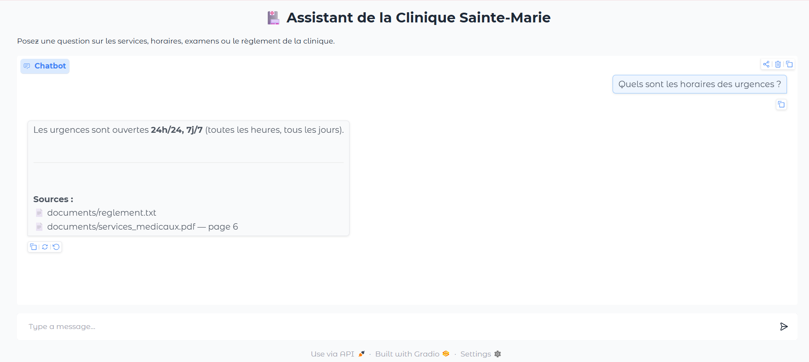
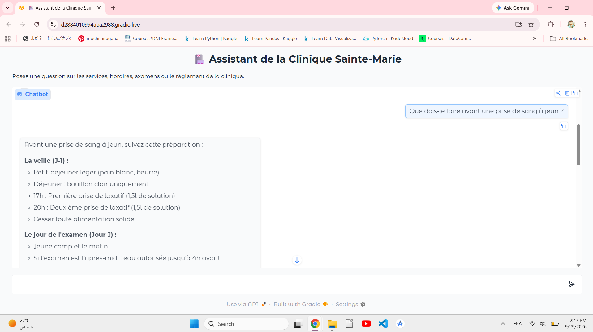
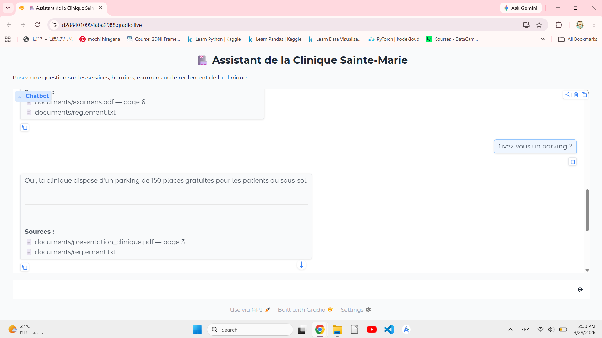
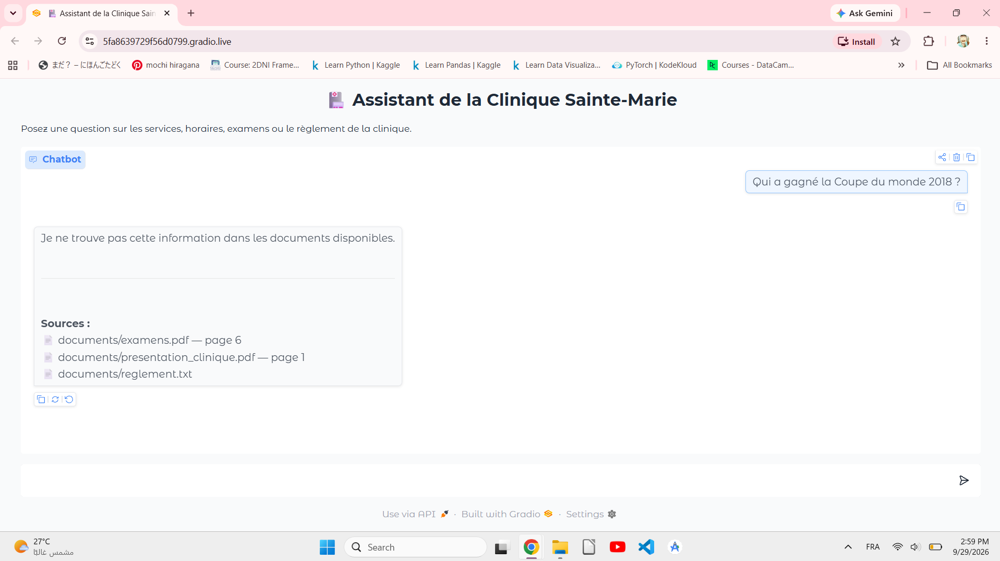

# 🏥 Clinic RAG Assistant

A French-language chatbot that answers questions about a clinic (opening hours, medical services, exams, internal rules) using **Retrieval-Augmented Generation (RAG)**. It answers only from the clinic's documents, cites its sources (file and page), and is instructed never to give a medical diagnosis.

> ⚠️ **Note:** "Clinique Sainte-Marie" is a fictional clinic. All documents in `documents/` were written by me for this demo. The documents and the chatbot are in French.

---

## 🎬 Demo

| Question (FR) | English translation |
|---|---|
| Quels sont les horaires des urgences ? | What are the emergency room hours? |
| Que dois-je faire avant une prise de sang à jeun ? | What should I do before a fasting blood test? |
| Avez-vous un parking ? | Do you have a parking lot? |
| A question outside the documents | The bot should say it cannot find the information |

### 🚑 Emergency hours


### 🩸 Fasting blood test


### 🅿️ Parking


### 🚫 Question outside the documents


---

## ⚙️ How it works

```
PDF / TXT documents
      ↓  load (PyPDFLoader, TextLoader)
Text chunks (800 characters, 150 overlap)
      ↓  embed (sentence-transformers/all-MiniLM-L6-v2)
ChromaDB vector store
      ↓  retrieve top-5 chunks similar to the question
Prompt (strict rules + retrieved context)
      ↓  LLM via OpenRouter
Answer + sources (file, page)
```

1. 📄 **Loading:** PDF and TXT files are loaded with LangChain loaders.
2. ✂️ **Chunking:** `RecursiveCharacterTextSplitter` with `chunk_size=800` and `chunk_overlap=150`.
3. 🔢 **Embeddings:** `sentence-transformers/all-MiniLM-L6-v2` through `langchain-huggingface`.
4. 🗄️ **Vector store:** ChromaDB, with similarity search returning the top 5 chunks (`k=5`).
5. 🤖 **Generation:** the prompt tells the LLM to answer only from the context, combine information across chunks, reply in short French sentences, and refuse to give medical diagnoses. If the answer is not in the context, it must say so.
6. 💬 **Interface:** a Gradio chat that shows the answer and the source files with page numbers.

---

## 🛠️ Tech stack

Python • LangChain • ChromaDB • sentence-transformers • OpenRouter API • Gradio • Google Colab

The LLM is called with `openrouter/free`, which routes each request to an available free model. Because of this, the exact model and response speed can vary between runs.

---

## 📚 Documents

Five sample documents about the fictional clinic: `examens`, `horaires`, `presentation_clinique`, `reglement`, `services_medicaux`.

---

## ▶️ Run it yourself

1. Open the notebook in Google Colab.
2. Get an [OpenRouter](https://openrouter.ai) API key and add it in Colab **Secrets** under the name `OpenRouterKey`, with notebook access turned on. 🔑 Never paste the key into the code.
3. Run the cells in order and upload the files from the `documents/` folder when asked.
4. When the console chat asks for a question, type `exit` to continue to the Gradio interface.
5. Open the Gradio link and ask a question.

---

## 🚧 Known limitations

- The source list is also displayed when the bot answers that it cannot find the information, which can look contradictory.
- Free OpenRouter models are rate limited and can be slow or temporarily unavailable.
- The Gradio `share=True` link expires after a few days, which is why this repo uses screenshots as the demo.
- The vector store is rebuilt every time the notebook runs (it is not saved to disk).
- Retrieval quality was checked by hand on a few questions only, with no automatic evaluation.

---

## 🚀 Possible improvements

- Use a multilingual embedding model such as `paraphrase-multilingual-MiniLM-L12-v2`, since `all-MiniLM-L6-v2` is mainly trained on English.
- Return a dedicated "I cannot give a diagnosis" answer for symptom questions and hide sources on refusals.
- Save the vector store to disk and add a small set of test questions to measure retrieval quality.

---

## 👩‍💻 Author

**Tasnim Sakni** — Telecommunications & Computer Engineering student, focused on AI, LLMs and RAG.
